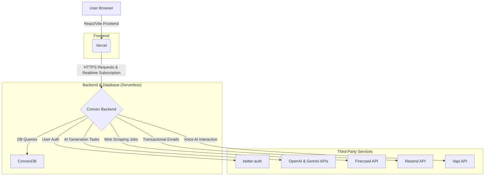

# VentureSmith: Your AI Co-Founder 🚀

[](https://venturesmith.vercel.app/)
[](https://opensource.org/licenses/MIT)
[](https://convex.dev)
[](https://react.dev)
[](https://vitejs.dev)

**VentureSmith is an AI-powered web application designed to be the ultimate co-founder for aspiring entrepreneurs. It transforms a simple business idea into a comprehensive, venture-ready blueprint, automating everything from business planning to market research and prototype generation.**

This project was built for a hackathon, showcasing the power of modern AI and serverless technologies to accelerate innovation.

---

### ✨ [Live Demo](https://venturesmith.vercel.app/) | 🎬 [Video Walkthrough](https://www.youtube.com/watch?v=dQw4w9WgXcQ)

---

## 🏆 Core Technologies & Hackathon Partners

VentureSmith is proud to be built with cutting-edge technologies from our hackathon partners. We've integrated their services to create a seamless and powerful experience.

-   **[Convex](https://convex.dev/): The Backend Platform**
    -   **What it does:** Convex serves as our entire backend, providing a realtime database, serverless functions, and file storage. All business logic, from user management to orchestrating AI tasks, runs on Convex.
    -   **Why we chose it:** Its realtime capabilities ensure the UI is always in sync with the backend state, providing a fluid and responsive user experience without manual state management.

-   **[better-auth](https://github.com/better-auth/better-auth): Secure Authentication**
    -   **What it does:** Handles all user sign-ups and logins, integrating smoothly with Convex to provide a secure authentication flow.
    -   **Why we chose it:** It provides a simple, secure, and robust authentication solution out of the box, saving us significant development time.

-   **[OpenAI](https://openai.com/product): The Primary AI Engine**
    -   **What it does:** Powers the majority of the generative tasks in the SmithWorkspace, including business plan creation, marketing copy, and technical documentation.
    -   **Why we chose it:** Provides state-of-the-art models (like GPT-4) for a wide range of creative and analytical text generation tasks.

-   **[Google Gemini](https://ai.google.dev/): Specialized AI Tasks**
    -   **What it does:** The Gemini API is used for specific, high-value tasks that require its unique multimodal and reasoning capabilities, such as the VentureChatbot.
    -   **Why we chose it:** It offers powerful, next-generation models that complement OpenAI, allowing us to choose the best tool for each job.

-   **[Firecrawl](https://firecrawl.dev/): Web Scraping & Data Extraction**
    -   **What it does:** Firecrawl is the engine behind our market research features. It scrapes websites and extracts clean, structured data for analysis.
    -   **Features Powered:** Deep Market Analysis, Competitor Matrix, AI Investor Matching.
    -   **Why we chose it:** It turns the messy web into a structured, queryable data source, enabling powerful, real-time market insights that would otherwise be impossible.

-   **[Vapi](https://vapi.ai/): Conversational Voice AI**
    -   **What it does:** Vapi powers our interactive voice features, allowing users to practice their pitch and interact with an AI agent in a natural conversation.
    -   **Features Powered:** AI Pitch Coach, Venture Call Agent.
    -   **Why we chose it:** It provides a low-latency, highly realistic conversational AI experience that is critical for effective pitch practice and simulations.

-   **[Resend](https://resend.com/): Transactional Emails**
    -   **What it does:** Manages and sends all transactional emails, such as email verification and user notifications.
    -   **Why we chose it:** A reliable and developer-friendly email API that ensures our users stay informed.

## 🌟 Key Features & The Tech Behind Them

VentureSmith is packed with AI-driven tools to cover every aspect of early-stage startup development. Here’s a look at what you can build and the technologies that make it happen.

### 📈 Strategy & Planning (Powered by OpenAI)
- **📝 Business Plan Generation:** Creates a full business plan from a single idea prompt.
- **🎯 Mission & Vision Crafting:** Defines a strong foundation for your brand.
- **🗺️ Development Roadmap:** Lays out a technical timeline and milestones.
- **✅ Due Diligence Checklist:** Prepares you for investor scrutiny.
- **💡 Idea Brainstorming & A/B Testing:** Generates creative ideas and testing strategies.

### 📊 Market & Customer Analysis (Powered by Firecrawl & OpenAI)
- **🌐 Deep Market Analysis:** Uses **Firecrawl** to scrape and analyze web data for market trends, then **OpenAI** to synthesize the findings.
- **👥 Customer Persona Creation:** Defines your ideal customer profiles using **OpenAI**.
- **🔍 Competitor Matrix:** Leverages **Firecrawl** to gather competitor data and presents it in a structured matrix.
- **📈 Growth Metrics Identification:** Helps you define KPIs to track success with suggestions from **OpenAI**.

### 🛠️ Product & Engineering (Powered by OpenAI)
- **💻 AI Wireframe Generator:** Creates visual mockups for your web application.
- **⚙️ Tech Stack Suggester:** Recommends the best technologies for your project.
- **🗃️ Database Schema Generation:** Designs the data model for your application.
- **🔌 API Endpoint Definition:** Drafts the API structure for your backend.
- **☁️ Cloud Cost Estimation:** Provides a preliminary budget for cloud infrastructure.

### 🚀 Marketing & Launch (Powered by OpenAI)
- **📢 Press Release Drafting:** Writes professional announcements for your launch.
- **✍️ Marketing Copy Generation:** Creates compelling copy for ads, landing pages, and social media.
- **🔎 SEO Strategy:** Generates a foundational SEO plan to improve online visibility.
- **🚀 Product Hunt Launch Kit:** Prepares materials for a successful Product Hunt debut.

### 💬 Interactive Tools (Powered by Vapi & Gemini)
- **🤖 VentureChatbot:** An AI assistant (**Gemini-powered**) trained on your business context to answer questions and provide guidance.
- **🧑‍🏫 AI Pitch Coach:** Practice your pitch in a real-time conversation with a voice AI powered by **Vapi**.
- **📞 Venture Call Agent:** An automated **Vapi** agent to handle initial customer inquiries or investor outreach simulations.
- **🃏 Pitch Deck Generation:** Creates a professional investor pitch deck.

### 🧪 Experimental Features
- **🤖 SmithBuild (Powered by Gemini):** Go beyond wireframes. SmithBuild is an experimental AI agent that can write, read, and edit the application's frontend code to build and prototype new web pages. You can build from scratch or use your existing venture context to generate pages that are consistent with your brand and business goals. It's a glimpse into the future of AI-driven development.

## 🏗️ Architecture

VentureSmith is built on a modern, serverless, and AI-first stack, orchestrated entirely by Convex.



## 🚀 Getting Started

To run VentureSmith on your local machine, follow these steps:

### Prerequisites

- Node.js (v18 or later)
- An account with [Convex](https://convex.dev)
- API keys for:
  - OpenAI
  - Google Gemini
  - Firecrawl
  - Resend
  - Vapi
  - Better-Auth

### Installation & Setup

1.  **Clone the repository:**
    ```bash
    git clone https://github.com/zaikaman/venturesmith.git
    cd venturesmith
    ```

2.  **Install dependencies:**
    ```bash
    npm install
    ```

3.  **Set up Convex:**
    - Login to Convex:
      ```bash
      npx convex dev
      ```
    - Follow the CLI prompts to link this project to your Convex account.

4.  **Configure Environment Variables:**
    - Create a `.env.local` file in the root directory by copying the example file:
      ```bash
      cp .env.example .env.local
      ```
    - Open `.env.local` and add your credentials. The `VITE_CONVEX_URL` will be provided in the output of the `npx convex dev` command.

    ```env
    # Convex deployment URL from `npx convex dev`
    VITE_CONVEX_URL="https://your-project.convex.cloud"

    # API Keys
    OPENAI_API_KEY="your_openai_api_key"
    GEMINI_API_KEY="your_gemini_api_key"
    FIRECRAWL_API_KEY="your_firecrawl_api_key"
    RESEND_API_KEY="your_resend_api_key"
    VAPI_API_KEY="your_vapi_api_key"
    BETTER_AUTH_API_KEY="your-better_auth_api_key"

5.  **Run the development server:**
    - The `npx convex dev` command from step 3 also runs the backend. In a new terminal, start the frontend:
    ```bash
    npm run dev
    ```
    - Open your browser and navigate to `http://localhost:3000`.

## 📂 Project Structure

The codebase is organized into logical directories:

```
/
├── convex/                 # Convex backend: serverless functions, schema, and auth
│   ├── actions.ts          # Core backend actions callable from the client
│   ├── openai.ts           # Logic for all OpenAI and Gemini API interactions
│   ├── firecrawl.ts        # Action for triggering Firecrawl web scraping
│   ├── smithWorkspaces.ts  # Backend logic for the SmithBuild feature
│   ├── startups.ts         # Backend logic for managing user ventures/startups
│   ├── users.ts            # Backend logic for user data
│   ├── schema.ts           # The database schema for the entire application
│   └── http.ts             # HTTP actions for webhooks (e.g., email verification)
│
├── src/                    # React frontend source code
│   ├── components/         # Reusable React components
│   │   ├── pages/          # Main page components for each feature/view
│   │   │   ├── SmithBuild.tsx      # The initial view for starting a build
│   │   │   ├── SmithWorkspace.tsx  # The main IDE/chat/preview workspace
│   │   │   └── ... (Other feature pages)
│   │   ├── chatbot/        # Components for the VentureChatbot
│   │   └── emails/         # React components for rendering transactional emails
│   │
│   ├── contexts/           # React Contexts for global state (e.g., Theme)
│   ├── hooks/              # Custom React hooks (e.g., useSmithChat)
│   ├── lib/                # Utility functions and client-side libraries
│   ├── App.tsx             # Main application component with routing
│   └── index.tsx           # Application entry point
│
├── public/                 # Static assets (images, logos, etc.)
├── .env.example            # Example environment variables
├── package.json            # Project dependencies and scripts
└── vite.config.ts          # Vite configuration
```

## 👥 Authors

- **zaikaman** - [GitHub Profile](https://github.com/zaikaman)

## 📄 License

This project is licensed under the MIT License - see the [LICENSE](LICENSE) file for details.
